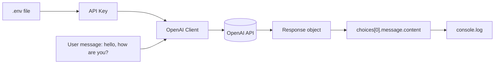
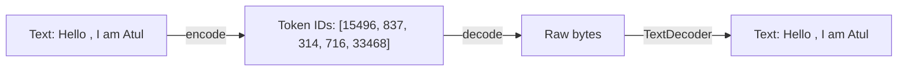

# GenAI Cohort - Class 01

# Getting Started with LLMs: First API Call and Tokenization

## 1. Introduction

This is the very first hands-on class of the cohort. The goal is simple but important:

> Understand what a Large Language Model (LLM) actually is from a developer's point of view, make your first API call to one, and learn how text is broken down into tokens before a model can understand it.

By the end of this class you should be able to:

- set up a Node.js project that talks to an LLM,
- make your first call to the OpenAI API,
- understand what a "token" is,
- encode text into tokens and decode tokens back into text.

This class contains two small but foundational programs:

- `hello.js` - your first LLM API call
- `token.js` - encoding and decoding text using tokens

---

## 2. What is an LLM (in simple terms)?

An LLM (Large Language Model) is a program that has been trained on a huge amount of text. Its core job is surprisingly simple to describe:

> Given some text, predict the next token.

It does this over and over, one token at a time, to produce full sentences, paragraphs, and code.

A helpful mental model:

```text
Input text  ->  LLM  ->  predicts next token  ->  appends it  ->  repeats
```

The model does not "think" like a human. It is a very powerful next-token predictor. Everything else (answering questions, writing code, chatting) is built on top of that single idea.

### Key point for developers

From our side, an LLM is usually just an **API call**:

```text
We send text  ->  API  ->  We get text back
```

We do not run the model ourselves. We send a request to a provider (like OpenAI) and read the response.

---

## 3. Project Setup

The project is a standard Node.js project using ES Modules.

### package.json

```json
{
  "name": "gen-ai",
  "type": "module",
  "dependencies": {
    "dotenv": "^17.4.2",
    "openai": "^6.45.0",
    "tiktoken": "^1.0.22"
  }
}
```

Important details:

- `"type": "module"` means we use `import` instead of `require`.
- `dotenv` loads secrets (like the API key) from a `.env` file.
- `openai` is the official OpenAI SDK.
- `tiktoken` is the library used for tokenization.

### Installing the dependencies

```bash
npm install
```

### The .env file

The API key must never be hard-coded in the source. It lives in a `.env` file:

```env
OPEN_AI_API_KEY=sk-your-secret-key-here
```

> The `.env` file should never be committed to Git. It contains a secret key that can cost real money if leaked.

---

## 4. Part 1: Your First API Call (`hello.js`)

This is the "hello world" of Generative AI. We send a simple message to the model and print its reply.

### The full code

```javascript
import "dotenv/config";

import { OpenAI } from "openai";

const client = new OpenAI({
  apiKey: process.env.OPEN_AI_API_KEY,
});

// Completions API, which is deprecated now.
client.chat.completions
  .create({
    model: "gpt-4",
    messages: [{ role: "user", content: "hello , how are you ?" }],
  })
  .then((response) => {
    console.log(response.choices[0].message.content);
  });
```

### Step-by-step explanation

**Step 1: Load environment variables**

```javascript
import "dotenv/config";
```

This line reads the `.env` file and makes its values available on `process.env`. Because of this, `process.env.OPEN_AI_API_KEY` will hold your secret key.

**Step 2: Import and create the client**

```javascript
import { OpenAI } from "openai";

const client = new OpenAI({
  apiKey: process.env.OPEN_AI_API_KEY,
});
```

The `client` object is our connection to OpenAI. It carries the API key so every request is authenticated.

**Step 3: Send a chat request**

```javascript
client.chat.completions.create({
  model: "gpt-4",
  messages: [{ role: "user", content: "hello , how are you ?" }],
});
```

Here we:

- pick a model (`gpt-4`),
- send a list of `messages`.

Each message has a `role` and `content`. The `user` role means "this text is from the human".

**Step 4: Read the response**

```javascript
.then((response) => {
  console.log(response.choices[0].message.content);
});
```

The API returns a response object. The actual text reply is nested inside:

```text
response.choices[0].message.content
```

We print that to the console.

### Flow diagram



### Running it

```bash
node hello.js
```

Expected output (the exact wording will vary each time):

```text
Hello! I'm doing well, thank you. How can I help you today?
```

---

## 5. Understanding the `messages` Array and Roles

The `messages` array is how we talk to a chat model. Each entry has a `role`:

| Role | Meaning |
| --- | --- |
| `system` | Instructions that set the model's behavior or personality |
| `user` | Messages coming from the human |
| `assistant` | Previous replies from the model |

In `hello.js` we only used a single `user` message. In later classes we will add `system` prompts and full conversation history.

### Simple example

```javascript
messages: [
  { role: "system", content: "You are a helpful assistant." },
  { role: "user", content: "What is 2 + 2?" },
];
```

---

## 6. A Note on "Completions" vs "Chat Completions"

The comment in the code says:

```javascript
// Completions API, which is deprecated now.
```

This is an important historical point:

- The **old Completions API** took a single block of text and continued it.
- The **Chat Completions API** (what we use here) takes a list of messages with roles.

The chat-style format is now the standard because it maps naturally to conversations, system instructions, and multi-turn context.

> Note: The code actually uses `chat.completions.create`, which is the current chat format. The comment is just flagging that the older plain "completions" style is deprecated.

---

## 7. Part 2: Tokenization (`token.js`)

Before an LLM can read text, the text is broken into small pieces called **tokens**. This process is called **tokenization**.

### Why tokens matter

- Models do not read raw characters or full words. They read tokens.
- Token count decides **cost** (you pay per token).
- Token count decides how much fits in the **context window**.

A token is often a word, part of a word, or even punctuation. For English text, a rough rule of thumb is:

```text
1 token  ~=  4 characters  ~=  3/4 of a word
```

### The full code

```javascript
import { get_encoding } from "tiktoken";

const encoderForGpt2 = get_encoding("gpt2");

//! Encoded Step
const encoded = encoderForGpt2.encode("Hello , I am Atul");
console.log(encoded);

//! Decoded Step
const decoded = encoderForGpt2.decode(encoded);
console.log(new TextDecoder().decode(decoded));
```

### Step-by-step explanation

**Step 1: Get an encoder**

```javascript
import { get_encoding } from "tiktoken";

const encoderForGpt2 = get_encoding("gpt2");
```

`tiktoken` is a tokenizer library. Here we load the `gpt2` encoding scheme. An "encoding" is just a specific set of rules for how text is split into tokens.

**Step 2: Encode (text to tokens)**

```javascript
const encoded = encoderForGpt2.encode("Hello , I am Atul");
console.log(encoded);
```

This turns the string into an array of numbers. Each number is the ID of one token. Example output:

```text
[15496, 837, 314, 716, 33468]
```

Each number represents one token that the model can understand.

**Step 3: Decode (tokens back to text)**

```javascript
const decoded = encoderForGpt2.decode(encoded);
console.log(new TextDecoder().decode(decoded));
```

Decoding reverses the process. It takes token IDs and reconstructs the original text.

One extra detail: `decode` returns raw bytes, so we use `new TextDecoder().decode(...)` to turn those bytes back into a readable string.

Expected output:

```text
Hello , I am Atul
```

### Encode / Decode flow



### Running it

```bash
node token.js
```

---

## 8. Encoding vs Decoding (Mental Model)

Think of tokenization like a translation between two languages:

- **Encode** = human text  ->  numbers the model understands
- **Decode** = numbers from the model  ->  human text

```text
"Hello"  --encode-->  15496  --decode-->  "Hello"
```

The model only ever works with the numbers. Encoding happens before the model reads your input, and decoding happens after the model produces its output.

---

## 9. Why This Matters for Later Classes

Everything in this cohort builds on these two ideas:

1. **An LLM is an API call.** You send messages, you get a response. Later we add system prompts, conversation history, tools, and memory, but the base is always this request/response loop.

2. **Text is tokens.** Cost, context limits, and truncation all depend on tokens. Understanding tokenization helps you reason about why prompts get expensive or get cut off.

---

## 10. Common Issues and Fixes

| Problem | Likely cause | Fix |
| --- | --- | --- |
| `401 Unauthorized` | Missing or wrong API key | Check `.env` and the key name `OPEN_AI_API_KEY` |
| `undefined` API key | dotenv not loaded | Ensure `import "dotenv/config"` is at the top |
| `Cannot use import` | Missing module type | Ensure `"type": "module"` is in `package.json` |
| Garbled decoded text | Forgot `TextDecoder` | Wrap decode output in `new TextDecoder().decode(...)` |
| Model not found | Deprecated/unavailable model | Use a currently supported model name |

---

## 11. Key Commands Reference

```bash
# Install all dependencies
npm install

# Run the first API call
node hello.js

# Run the tokenization example
node token.js
```

---

## 12. Interview-Ready Explanation

If asked about this class in an interview, a good answer would be:

> An LLM is fundamentally a next-token predictor exposed to us as an API. We authenticate with a key, send a list of role-based messages, and read the model's reply from the response. Before the model can process text, that text is tokenized: it is split into token IDs using an encoding scheme like the one from tiktoken. Encoding converts text to token IDs and decoding converts them back. Token count directly affects both cost and how much content fits in the context window.

---

## 13. Quick Revision Summary

- An LLM predicts the next token, one token at a time.
- To us, an LLM is just an API call: send messages, get a response.
- `dotenv` keeps the API key out of the source code.
- The OpenAI client is created with the API key from `.env`.
- Messages use roles: `system`, `user`, `assistant`.
- The reply is at `response.choices[0].message.content`.
- Tokenization splits text into tokens (small chunks).
- `encode` turns text into token IDs.
- `decode` turns token IDs back into text.
- Tokens decide cost and context-window usage.

---

## 14. One-Sentence Final Answer

Class 01 teaches the two foundations of working with LLMs: making your first authenticated API call to a chat model, and understanding that all text is first converted into tokens through encoding and decoding.

---

## 15. Practice Questions

1. What does an LLM fundamentally do at each step?
2. Why do we store the API key in a `.env` file instead of the code?
3. What is the purpose of the `role` field in a message?
4. Where in the response object is the model's text reply located?
5. What is a token, and why does token count matter?
6. What is the difference between encoding and decoding?
7. Why do we wrap the decoded output in `new TextDecoder()`?
8. What is the difference between the old Completions API and the Chat Completions API?
