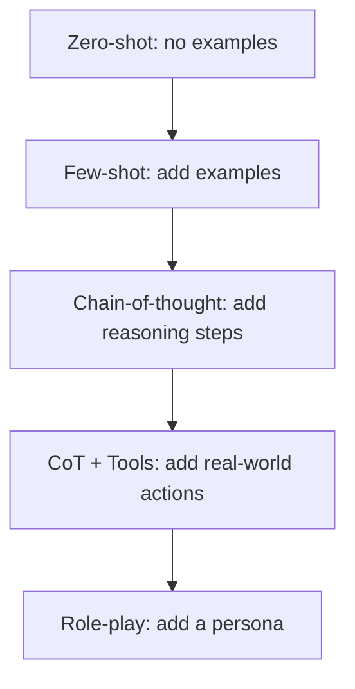
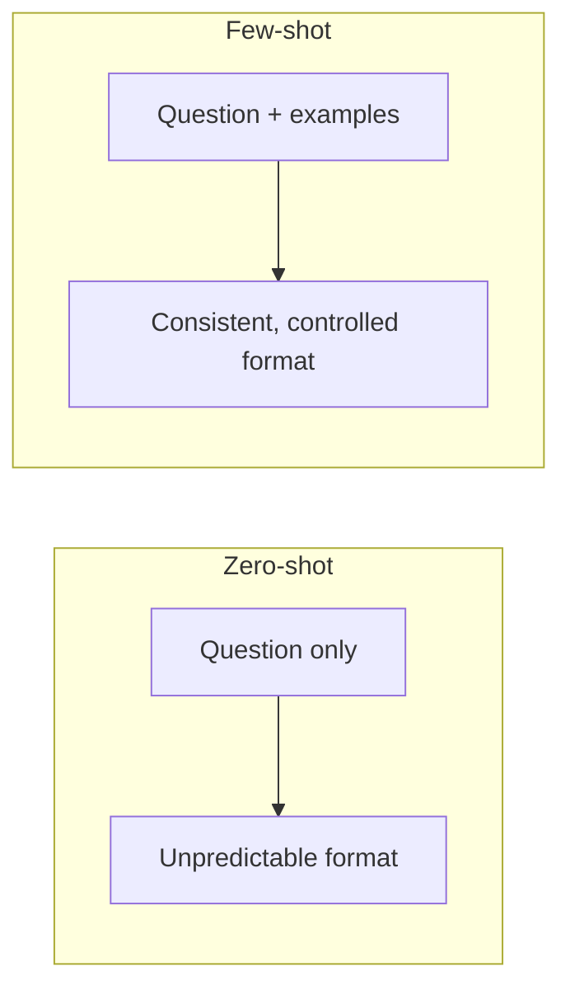
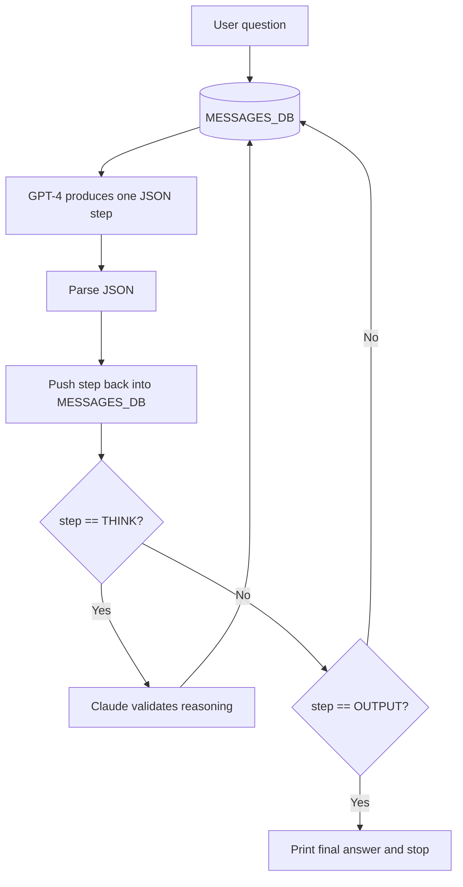
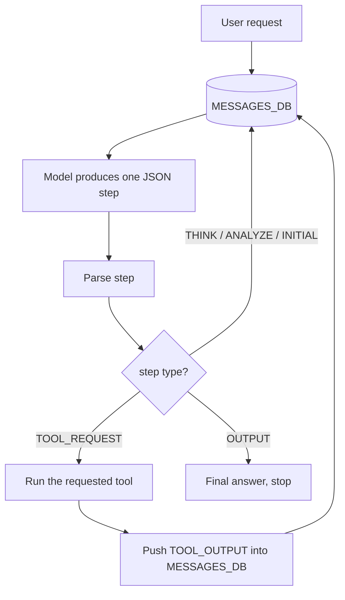
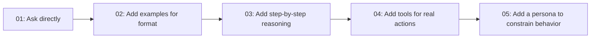

# GenAI Cohort - Class 02

# Prompting Techniques: Zero-Shot, Few-Shot, Chain-of-Thought, Tools, and Personas

## 1. Introduction

Class 01 taught us how to make a basic API call. This class is about the single most important skill when working with LLMs:

> How you ask matters as much as what you ask. The way a prompt is written directly controls the quality of the answer.

This is called **prompt engineering**. In this class we build five small programs, each demonstrating a different prompting technique, and gradually turn a plain chatbot into a reasoning agent that can use tools and follow a persona.

The five files, in learning order:

| File | Technique |
| --- | --- |
| `01-zero.js` | Zero-shot prompting |
| `02-few-shot.js` | Few-shot prompting |
| `03-cot.js` | Chain-of-thought prompting (with a validation loop) |
| `04-cot-tool.js` | Chain-of-thought + tool calling |
| `05-role-play.js` | Role-play / persona prompting |

There is also `prompts.md`, a short notes file summarizing the four prompting types.

---

## 2. The Four Prompting Techniques (Overview)

The `prompts.md` file summarizes the core idea of each technique. Here is the expanded version.

### 1. Zero-shot prompting

The model gets a task with **no examples**. It must answer using only its training and the instruction.

> "What is 2 + 2?"

### 2. Few-shot prompting

The model gets a task **plus a few input-output examples**. The examples steer the format and style of the answer.

> "Here are two solved examples. Now solve this one in the same style."

### 3. Chain-of-thought (CoT) prompting

The model is asked to **show its reasoning step by step** before giving the final answer. This improves accuracy on complex problems because the model "thinks out loud" instead of jumping to a conclusion.

### 4. Role-play prompting

The model is told to **act as a specific persona** (for example, a senior software engineer). This shapes tone, scope, and behavior.



Each step adds more control over the model's behavior.

---

## 3. Project Setup

### package.json

```json
{
  "name": "class-02",
  "type": "module",
  "dependencies": {
    "@anthropic-ai/sdk": "^0.39.0",
    "axios": "^1.18.1",
    "dotenv": "^17.4.2",
    "openai": "^6.45.0"
  }
}
```

New dependencies compared to Class 01:

- `@anthropic-ai/sdk` - Claude SDK, used in `03-cot.js` to validate reasoning.
- `axios` - HTTP client, used to call a weather API in the tool examples.

### Install

```bash
npm install
```

### .env

```env
OPEN_AI_API_KEY=sk-your-openai-key
ANTHROPIC_API_KEY=sk-ant-your-claude-key
```

The Anthropic key is only required for `03-cot.js`. The others just need the OpenAI key.

---

## 4. Zero-Shot Prompting (`01-zero.js`)

This is the simplest possible prompt: ask a question directly, with no examples.

```javascript
import "dotenv/config";
import { OpenAI } from "openai";

const client = new OpenAI({
  apiKey: process.env.OPEN_AI_API_KEY,
});

async function run() {
  const result = await client.chat.completions.create({
    model: "gpt-4",
    messages: [
      { role: "user", content: "You are an expert tell me what is 2 + 2 ?" },
    ],
  });
  console.log("OpenAI Response : ", result.choices[0].message.content);
}

run();
```

### What is happening

- A single `user` message is sent.
- No examples, no reasoning steps, no persona.
- The model answers using only its own knowledge.

### When to use zero-shot

- Simple, well-known tasks.
- Quick questions where format does not matter much.

### Limitation

You have little control over the **format** of the answer. The model might say "4", or "The answer is 4", or write a paragraph. That is exactly the problem few-shot prompting solves next.

---

## 5. Few-Shot Prompting (`02-few-shot.js`)

Here we give the model examples so it copies the desired output format.

```javascript
messages: [
  {
    role: "user",
    content: `
    What is 2 + 2 Equals ?
    Do not add anything else in ans , take the samples from the examples
    Examples:
    - what is 5 + 4 Equals ?
      Expected Output: 9(Nine)
    - what is 10 + 10 Equals ?
      Expected Output: 20(Twenty)
    `,
  },
];
```

### What is happening

- We show two solved examples with a very specific output format: `number(NumberInWords)`.
- We instruct the model not to add anything extra.
- The model learns the pattern and answers the new question in the same style.

Expected output:

```text
4(Four)
```

### Why this works

The examples act as a template. The model is very good at pattern matching, so showing it `9(Nine)` and `20(Twenty)` teaches it to produce `4(Four)` without us writing any rules.

### Zero-shot vs Few-shot



### When to use few-shot

- When the output must follow a specific format.
- When zero-shot answers are inconsistent.
- When describing the rules is harder than just showing examples.

---

## 6. Chain-of-Thought Prompting (`03-cot.js`)

This is the biggest jump in the class. Instead of a single answer, we force the model to reason in **explicit steps** using a structured pipeline.

### The pipeline

The system prompt defines a strict sequence of steps:

```text
INITIAL -> THINK -> ANALYZE -> THINK -> ANALYZE -> ... -> OUTPUT
```

Each step has a clear job:

| Step | Purpose |
| --- | --- |
| `INITIAL` | Restate what the user wants and identify the problem |
| `THINK` | Break the problem down and work on one sub-problem |
| `ANALYZE` | Verify the previous thinking step is correct |
| `OUTPUT` | Give the final answer and explain how it was reached |

### Forcing structured JSON output

The system prompt requires every response to be valid JSON:

```json
{ "step": "THINK", "text": "<the actual text>" }
```

This is what lets our code read the model's output programmatically instead of parsing free text.

### The loop

```javascript
const MESSAGES_DB = [{ role: "system", content: SYSTEM_PROMPT }];

async function run(prompt = "") {
  MESSAGES_DB.push({ role: "user", content: prompt });

  while (true) {
    const result = await client.chat.completions.create({
      model: "gpt-4",
      messages: MESSAGES_DB,
    });

    const rawResult = result.choices[0].message.content;
    const parsedResult = JSON.parse(rawResult);

    // Push each step back so the model remembers its own reasoning
    MESSAGES_DB.push({ role: "assistant", content: rawResult });

    console.log(`🤖 (${parsedResult.step}) : ${parsedResult.text}`);

    if (parsedResult.step.toUpperCase() === "OUTPUT") break;
  }
}
```

### Why we push each step back into `MESSAGES_DB`

The model is stateless (recall Class 01). To make it continue its own reasoning, we push every step it produces back into the message list. On the next loop, it sees all previous steps and knows what to do next. Without this, it would restart from scratch every time.

### The Claude validation twist

This file also demonstrates using a **second model to check the first model's reasoning**. Whenever GPT produces a `THINK` step, Claude reviews it:

```javascript
if (parsedResult.step.toUpperCase() === "THINK") {
  const validationResult = await claude.messages.create({
    model: "claude-opus-4-8",
    max_tokens: 256,
    messages: [{ role: "user", content: validationPrompt }],
  });
  // ...push Claude's verdict back into the conversation
}
```

Claude is asked to return `{"isCorrect": true|false, "feedback": "..."}`. If the Anthropic key is missing, this step is safely skipped with a warning.

### Full flow diagram



### Why chain-of-thought matters

Breaking a problem into steps and verifying each one dramatically reduces mistakes on complex reasoning and math. This step-by-step JSON pipeline is also the foundation for building **agents**, which we do in the next file.

---

## 7. Chain-of-Thought + Tools (`04-cot-tool.js`)

A model can reason, but it cannot check live weather or run a command on your computer. Tools fix that. This file adds a new pipeline step: `TOOL_REQUEST`.

### The new step

```text
INITIAL -> THINK -> ANALYZE -> TOOL_REQUEST -> (tool runs) -> THINK -> OUTPUT
```

When the model needs external data or an action, it outputs:

```json
{ "step": "TOOL_REQUEST", "functionName": "getWeatherData", "input": "Goa" }
```

### Available tools

Two real functions are defined in the code:

```javascript
// Fetches live weather using the wttr.in service
async function getWeatherData(cityName) {
  const url = `https://wttr.in/${cityName.toLowerCase()}?format=%C+%t`;
  const result = await axios.get(url, { responseType: "text" });
  return JSON.stringify({ cityName, weatherInfo: result.data });
}

// Runs a shell command on the machine
async function executeCommandOnCli(cmd) {
  return new Promise((res) => {
    exec(cmd, (err, out) => {
      if (err) return res(`There was an Error : ${err}`);
      else return res(out);
    });
  });
}
```

### How the loop handles a tool request

```javascript
if (parsedResult.step.toUpperCase() === "TOOL_REQUEST") {
  const toolName = parsedResult.functionName;
  const toolInput = parsedResult.input;

  if (toolName === "getWeatherData") {
    const toolResult = await getWeatherData(toolInput);
    MESSAGES_DB.push({
      role: "developer",
      content: JSON.stringify({ step: "TOOL_OUTPUT", output: toolResult }),
    });
  }
  // ...same pattern for executeCommandOnCli
}
```

Key idea: after the tool runs, we push the **tool output** back into the conversation (as a `developer` message). The model then reads that output and continues reasoning toward the final answer.

### The full agent loop



### The demo task

The file runs a genuinely agentic request:

```javascript
run(
  "What is the weather of Goa . and then write the output on a beautiful webpage . create a folder named weather and create all HTML and CSS files there and then run this on my browser",
);
```

To complete this, the model must:

1. call `getWeatherData("Goa")`,
2. use `executeCommandOnCli` to create a `weather` folder and write HTML/CSS files,
3. open the page in the browser.

This is why the `weather/` folder (with `index.html` and `style.css`) exists in this class. It was generated by the agent.

### Security note

`executeCommandOnCli` lets the model run **any** command on your machine. That is powerful but risky. In real systems you would sandbox this, whitelist allowed commands, or require confirmation. Treat model-generated commands as untrusted.

---

## 8. Role-Play / Persona Prompting (`05-role-play.js`)

This file is almost identical to `04-cot-tool.js` (same pipeline, same tools), but it adds a **persona** to the system prompt to constrain the model's behavior.

### The added persona

```text
You are an expert AI Engineer. Only and Only answer the Questions related to
the code and programming.

Persona: You are senior software engineer
Persona Traits:
  - You always sound Technical and Professional in your responses.
  - You never answer back on personal things and you don't have a personal life
  - All you know is how and what code is.
```

### What this changes

The pipeline and tools are the same, but now the model:

- stays strictly on programming topics,
- keeps a professional, technical tone,
- refuses off-topic or personal questions.

### The demo shows the guardrail in action

```javascript
run("What is the meaning of life ? ");
```

Because "the meaning of life" is not a programming question, the persona should make the model decline or redirect, instead of philosophizing. This demonstrates how a persona acts as a behavioral guardrail.

### Why personas matter

- **Scope control**: keep a support bot focused on its domain.
- **Tone control**: professional, friendly, formal, etc.
- **Safety**: refuse categories of requests.
- **Consistency**: every answer feels like the same "character".

---

## 9. Putting It All Together

Across the five files, the chatbot evolves into an agent:



Each technique is a layer of control:

- **Zero-shot**: what to ask.
- **Few-shot**: how the answer should look.
- **Chain-of-thought**: how the model should reason.
- **Tools**: what the model can do in the real world.
- **Persona**: how the model should behave.

---

## 10. Key Concepts Explained Simply

### Why JSON output?

By forcing the model to reply in JSON (`{"step": ..., "text": ...}`), our code can reliably read what step the model is on and act accordingly. Free-form text is hard for a program to parse; structured JSON is easy.

### Why the message list keeps growing

Each step (and each tool output) is pushed back into `MESSAGES_DB`. This gives the stateless model a "memory" of its own reasoning for the current task, so it can continue instead of restarting.

### The `developer` role

Tool outputs are pushed with `role: "developer"`. This tells the model "this is system/tool-provided information", separate from the human's `user` messages and the model's own `assistant` messages.

---

## 11. Common Issues and Fixes

| Problem | Likely cause | Fix |
| --- | --- | --- |
| `JSON.parse` error | Model returned text, not pure JSON | Strengthen the "always output JSON" rule in the system prompt |
| Claude step skipped | `ANTHROPIC_API_KEY` not set | Add the key to `.env` (or ignore, it is optional) |
| Infinite loop | Model never emits `OUTPUT` | Add a max-iteration safety counter |
| Weather call fails | Network / city name issue | Check the city name and internet connection |
| Command does nothing | OS-specific command | Use commands valid for your operating system |

---

## 12. Commands Reference

```bash
npm install          # install dependencies

node 01-zero.js      # zero-shot
node 02-few-shot.js  # few-shot
node 03-cot.js       # chain-of-thought + Claude validation
node 04-cot-tool.js  # chain-of-thought with tools
node 05-role-play.js # persona + tools
```

---

## 13. Interview-Ready Explanation

> Prompt engineering is controlling model behavior through how you phrase the input. Zero-shot asks directly with no examples. Few-shot adds input-output examples to lock the output format. Chain-of-thought forces the model to reason step by step, which improves accuracy on complex tasks. By making those steps structured JSON and looping the output back into the conversation, we build an agent that can also request tools, like fetching weather or running a command, and then continue reasoning with the tool's result. Finally, a persona in the system prompt constrains tone and scope so the assistant stays on-topic and behaves consistently.

---

## 14. Quick Revision Summary

- Prompting technique directly controls answer quality.
- Zero-shot = no examples; simplest but least controlled.
- Few-shot = examples steer the output format.
- Chain-of-thought = explicit step-by-step reasoning.
- Structured JSON output makes reasoning machine-readable.
- Pushing steps back into the message list gives the model working memory.
- Tools (`TOOL_REQUEST`) let the model act in the real world.
- Tool output is fed back so the model can finish the task.
- Personas constrain tone, scope, and behavior.
- The five files together turn a chatbot into a tool-using agent.

---

## 15. One-Sentence Final Answer

Class 02 teaches prompt engineering as a ladder of control: from asking directly (zero-shot), to showing examples (few-shot), to guided reasoning (chain-of-thought), to real-world action (tools), to constrained behavior (personas).

---

## 16. Practice Questions

1. What is the difference between zero-shot and few-shot prompting?
2. Why does few-shot prompting produce more consistent output formats?
3. What problem does chain-of-thought prompting solve?
4. Why must the model output valid JSON in the CoT pipeline?
5. Why do we push each step back into `MESSAGES_DB`?
6. What role does the `TOOL_REQUEST` step play in the agent loop?
7. Why is `executeCommandOnCli` a security risk, and how would you mitigate it?
8. How does a persona in the system prompt change the model's behavior?
9. In `03-cot.js`, what is the purpose of the Claude validation step?
