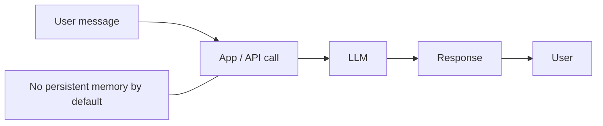
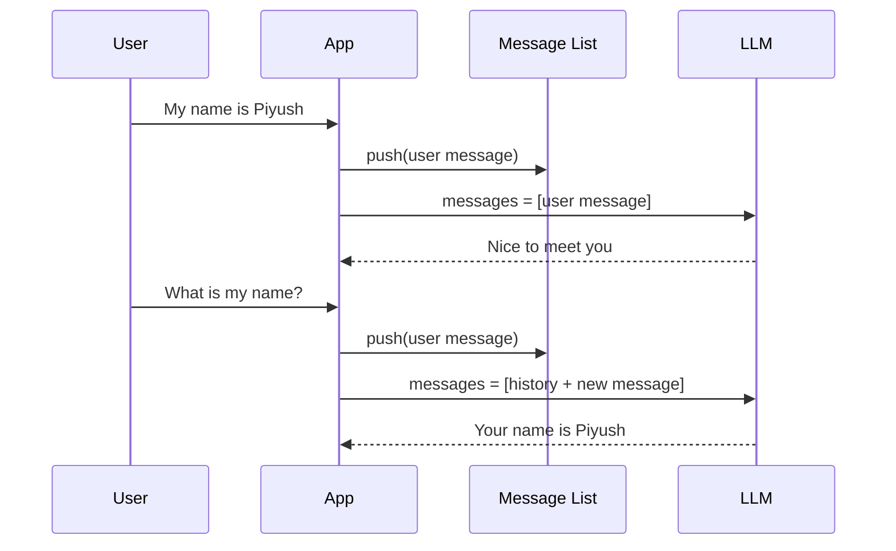
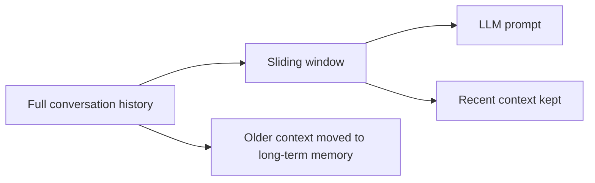
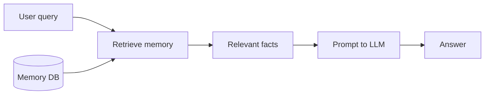
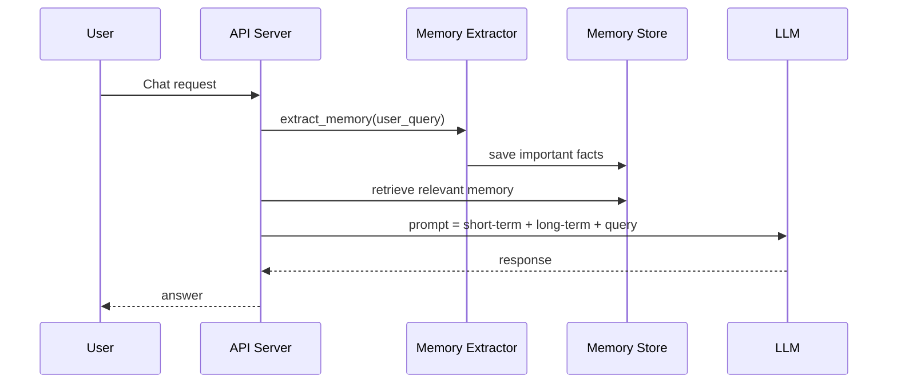
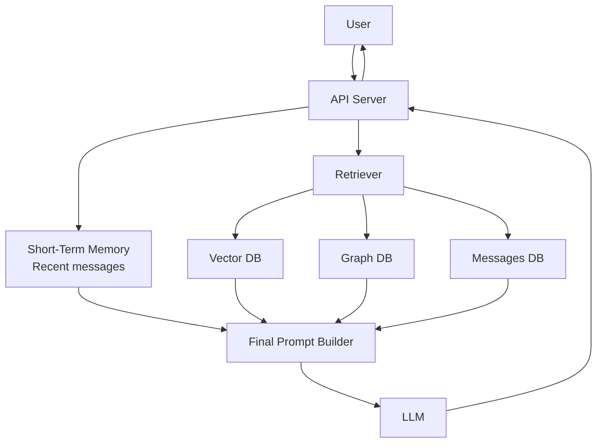

# Memory in AI Agents

This class explains how an AI agent remembers things across turns, why memory is needed, and how short-term and long-term memory work together.

The main idea is simple:

- A basic LLM is stateless.
- A chat app can fake memory by sending old messages again.
- A real agent stores useful information and retrieves only what matters.

---

## 1. Why Memory Is Needed

Without memory, every request is treated like the first request.

Example:

- User: “My name is Piyush.”
- Later user: “What is my name?”

If the model does not receive earlier context, it cannot answer correctly.

This is why memory matters in assistants, copilots, customer support bots, learning apps, and personal AI agents.

### Real-life analogy

Think of an assistant who forgets everything after every sentence. You would need to repeat your name, preferences, goals, and previous tasks again and again. Memory fixes that.

---

## 2. LLMs Are Stateless

An LLM does not permanently remember your chat by default.

It usually works like this:

1. Receive input.
2. Process the input.
3. Return output.
4. Forget everything unless the app sends history again.

This is why people say an LLM is an API call, not a living brain.

### Simple flow



### Example

- POST 1: “My name is Piyush”
- POST 2: “What is my name?”

If POST 2 does not include the first message, the model has no clue who Piyush is.

---

## 3. Disposable Context Window

The context window is the temporary space the model can read at one time.

It is limited, even when the limit is large.

Examples of common context sizes:

- 256k tokens
- 1M tokens
- 10M tokens
- 100M tokens in optimized systems

Larger windows help, but they are still not the same as memory.

### Why not send everything?

If you keep sending all old messages:

- latency increases
- token cost increases
- irrelevant noise increases
- the prompt becomes harder to manage

That is why agents need memory strategies.

---

## 4. Message History as Short-Term Memory

The simplest memory is message history.

The app stores the conversation in a list and sends it back to the model each time.

### Flow



### What happens inside the app

```javascript
messages = []

messages.push(userMessage)
messages.push(llmResponse)

// On next turn
messages.push(newUserMessage)
callLLM(messages)
```

### Good and bad

Good:

- easy to build
- works for short chats
- preserves exact wording

Bad:

- history grows forever
- expensive at scale
- slow with long conversations

---

## 5. The Sliding Window

Short-term memory often uses a sliding window.

The agent keeps only the most recent N messages, such as the last 10 or 20 turns.

### Why it helps

- keeps prompts small
- keeps recent context fresh
- removes older noise

### Example

If a chat has 3000 messages, sending all of them is wasteful.

Instead, the system can do:



### Real-life example

In a support chat, the last few messages matter most:

- the current issue
- the error code
- the user’s latest instruction

Old greetings are usually not needed.

---

## 6. Long-Term Memory

Long-term memory stores useful facts beyond the active context window.

This is where the agent remembers things like:

- user name
- age
- preferences
- goals
- tasks
- previous decisions

Long-term memory is not just a big text file. It is often structured and searchable.

### Common storage types

#### 1. SQL / Message DB

Useful for storing raw conversation messages.

Example query:

```sql
SELECT text
FROM messages
ORDER BY time DESC
LIMIT 10;
```

#### 2. Vector DB

Useful for semantic search.

It helps answer questions like:

- “What did the user say about their trip?”
- “Did they mention a favorite restaurant?”
- “Find related memories even if wording is different.”

#### 3. Graph DB

Useful for relationships between facts.

Example:

- Piyush is a user
- Piyush works on Node.js
- Piyush likes Teachyst

Graph memory is good when facts connect to each other.

### Long-term memory flow



---

## 7. Memory Extraction

Not every message should be saved forever.

The agent should extract only important facts.

### Example of extraction

Input:

- “My name is Piyush Garg”
- “I am 27 years old”
- “I’m working on Node.js in Teachyst”

Extracted memory:

- name = Piyush Garg
- age = 27
- current project = Node.js / Teachyst

### Why extraction matters

If everything is stored raw:

- memory grows too fast
- retrieval becomes noisy
- irrelevant details pollute the prompt

### Easy explanation

Think of extraction like taking notes from a meeting. You do not keep every word. You keep the useful points.

---

## 8. LTM Extract Pattern

One common pattern is:

1. read the user query
2. decide whether the query contains memory-worthy information
3. extract facts if needed
4. save them in the memory store
5. retrieve them later when useful

### Sequence diagram



### Real-life example

If the user says:

- “I am moving to Mumbai next month.”

The agent can store:

- upcoming city = Mumbai
- time = next month

Later it can help with travel, weather, housing, or commute-related questions.

---

## 9. Few-Shot Prompting and Memory

Few-shot prompting teaches the model by showing examples.

Memory does something similar, but at runtime.

### Few-shot example

- Input: “I am 27 years old”
- Output: “User is 27 years old”

The model learns the style of mapping user statements to stored facts.

### Why it matters

You can use few-shot examples to make memory extraction more reliable.

It is especially useful when the memory system needs to decide:

- what is a real fact
- what is a passing comment
- what should be stored

---

## 10. Eviction Policy

Memory cannot grow forever.

So the system needs an eviction policy, which decides what to keep and what to remove.

### Common eviction ideas

- keep recent messages
- keep high-value facts
- remove low-value repetition
- compress old content into summaries
- delete stale or contradictory memory

### Why this is important

If every sentence is stored forever:

- storage becomes huge
- retrieval gets slower
- irrelevant memory may confuse the model

### Simple mental model

Think of a desk:

- current notebook stays on top
- important documents go into a file cabinet
- junk papers are thrown away

That is exactly what eviction does for AI memory.

---

## 11. Architecture Pattern

This is a practical architecture for an AI agent with memory.



### What each part does

- API Server: receives the request
- Short-Term Memory: keeps recent turns
- Retriever: finds useful older memory
- Vector DB: finds semantically similar facts
- Graph DB: finds related connected facts
- Messages DB: stores chat history
- Final Prompt Builder: combines everything
- LLM: generates the answer

---

## 12. Real-Life Use Cases

### 1. Personal assistant

The user says:

- “My name is Piyush Garg.”
- “I work on Node.js.”
- “Remind me about my Teachyst project.”

Later the assistant can answer naturally without asking again.

### 2. Learning tutor

The student says:

- “I struggle with recursion.”
- “I prefer simple examples.”

The tutor can keep that preference and teach in a simpler style.

### 3. Customer support bot

The user says:

- “My order number is 1234.”
- “I want a refund.”

The bot can remember the order and continue the same thread.

### 4. Workplace copilot

The employee says:

- “I’m working on the Q4 launch.”
- “Use the India timezone.”

The copilot can reuse those facts in future planning.

---

## 13. Best Practices

- Keep short-term memory small and fresh.
- Store only meaningful long-term facts.
- Use summaries for old conversations.
- Retrieve memory only when it is relevant.
- Avoid sending the full history every time.
- Separate raw chat history from durable user facts.
- Re-check memory when facts can change.

---

## 14. Beginner-Friendly Summary

If you remember only one thing, remember this:

1. The LLM itself is stateless.
2. The app gives the LLM context.
3. Short-term memory keeps the recent chat.
4. Long-term memory stores useful facts.
5. Retrieval brings the right memory back.
6. Eviction removes old or unhelpful data.

So the full system feels like it remembers, even though the model itself only sees what the app sends.

---

## 15. One-Line Interview Answer

Memory in AI agents is a system that stores, retrieves, summarizes, and evicts useful information so the agent can behave consistently across multiple turns without sending the entire conversation every time.
