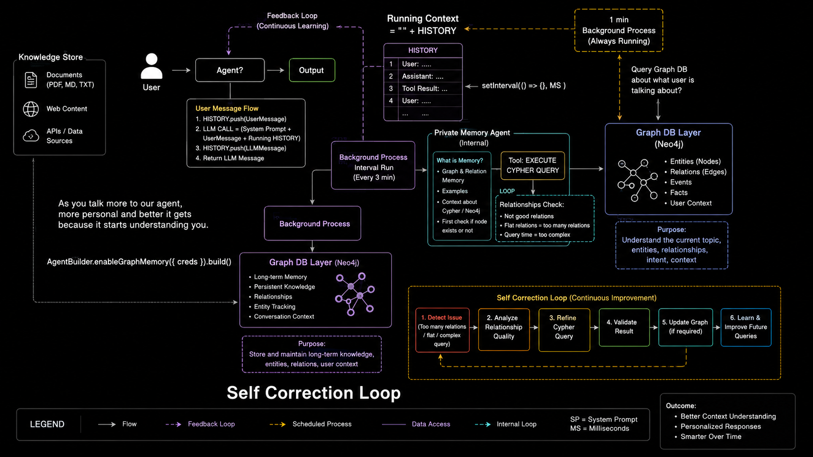

# GenAI Cohort - Class 14

# Graph Databases, Neo4j, and Cypher

## 1. Introduction

This class introduces one of the most important ideas in modern data engineering and AI systems:

> Graph databases are designed for connected data, not just stored data.

In real-world applications, the challenge is often not only what the data is, but how different entities are connected to each other.

Examples:

- A user follows another user
- A user likes a product
- A user is interested in a technology topic
- An account transfers money to another account
- A person works at a company and a company owns other companies

These are relationship-driven questions, and SQL alone is often not the most natural way to solve them.

---

## 2. Why do we need a Graph Database?

Imagine the following relationships:

- Alice likes CCD
- Alice hates HC
- Jane likes CCD
- Jane likes Hot Coffee
- Jane hates Rest
- Alice likes Jane

Now imagine asking:

- Who likes the same product as Jane?
- Who is connected to Alice through interests?
- Which products are strongly connected to similar users?

These are not standard row queries. They are traversal and pattern-matching problems.

A graph database is built for exactly this kind of question.

### Key idea

A graph database stores:

- Nodes: entities
- Relationships: connections
- Properties: metadata about nodes and edges

The main value is not only in the entity itself, but in the relationships between entities.

---

## 3. SQL vs NoSQL vs GraphDB

### SQL Database

SQL is best for structured data in tables.

Typical model:

- Users
- Products
- Likes

Example:

```sql
SELECT u.name
FROM Users u
JOIN Likes l ON u.id = l.user_id
JOIN Products p ON l.product_id = p.id
WHERE p.id IN (
    SELECT product_id
    FROM Likes
    WHERE user_id = 2
);
```

This works well when:

- the schema is known in advance,
- data is tabular,
- transactional consistency matters,
- reporting and aggregate queries are common.

But for deeply connected data, SQL often needs many joins and complex nested queries.

### NoSQL Database

NoSQL stores flexible, document-like or key-value data.

Example:

```json
{
  "name": "Jane",
  "likes": ["CCD", "Hot Coffee"],
  "hates": ["Rest"]
}
```

This is useful when:

- schemas evolve frequently,
- data is semi-structured,
- JSON-like storage is preferred.

However, as relationships become more important, document-based storage becomes harder to query naturally.

### Graph Database

Graph databases focus on relationship-heavy data.

The core representation is:

```text
NODE -> RELATIONSHIP -> NODE
```

Example:

```text
(Alice) --[:LIKES]--> (CCD)
(Alice) --[:LIKES]--> (Jane)
(Jane) --[:LIKES]--> (Hot Coffee)
```

### Comparison

| Database Type | Main Focus | Structure |
| --- | --- | --- |
| SQL | Structured data and transactions | Tables, rows, columns |
| NoSQL | Flexible data | Documents, key-value, collections |
| GraphDB | Connected data | Nodes, relationships, properties |

### One-line summary

- SQL answers: “Which rows match?”
- NoSQL answers: “Give me this document/object?”
- GraphDB answers: “How are these things connected?”

---

## 4. Core Graph Concepts

### Node
A node represents an entity.

Examples:

- User
- Product
- Company
- Interest
- Person

### Relationship
A relationship connects one node to another.

Examples:

- Alice LIKES CCD
- Alice FOLLOWS Bob
- Bob WORKS_AT Google
- Jane HATES Rest

### Property
A property stores information about the node or relationship.

Example:

```text
Alice { age: 22 }
Alice --[:LIKES { since: 2025 }]--> CCD
```

This allows the graph to contain rich metadata.

---

## 5. Why GraphDB is powerful

A graph database becomes highly valuable when the relationships are as important as the data itself.

### Common use cases

- Social networks
- Recommendation systems
- Fraud detection
- Knowledge graphs
- AI and semantic systems

### Example patterns

- User -> follows -> User
- User -> likes -> Post
- Customer -> bought -> Product
- Product -> belongsTo -> Category
- Account -> transfersTo -> Account

These queries are naturally pattern-based, and graph traversal is more efficient than complex join-heavy SQL for many of these tasks.

---

## 6. Why Neo4j?

Neo4j is one of the most popular graph databases in production.

It stores:

- Nodes
- Relationships
- Properties

It uses Cypher as its query language.

### Example

```cypher
MATCH (alice:User {name: "Alice"})-[:LIKES]->(coffee)
RETURN coffee
```

This means:

- find the user named Alice,
- follow the LIKES relationship,
- return the product or item she likes.

This is very natural because it mirrors the shape of the graph.

---

## 7. GraphDB and Schema Flexibility

Graph databases are often described as schema-flexible rather than completely schema-less.

Neo4j supports:

- labels,
- indexes,
- constraints,
- properties.

So even though the graph can accept varied node structures, it is still manageable and queryable.

Example:

```text
Alice {
  name: "Alice",
  age: 22
}
```

```text
Company {
  name: "Google",
  location: "California",
  employees: 100000
}
```

The different node types can have different properties without being forced into a single rigid table structure.

---

## 8. Mental Model for Database Design

### SQL mental model

> Give me the rows matching these conditions.

Leads to:

- tables
- joins
- row filtering
- aggregates

### NoSQL mental model

> Give me this document or flexible object.

Leads to:

- JSON-like objects
- flexible collections
- document retrieval

### GraphDB mental model

> Show me how these things are connected.

Leads to:

- nodes
- edges
- traversal patterns
- path queries

---

## 9. Neo4j and Cypher

Cypher is the query language used by Neo4j.

A simple Cypher query has this structure:

```cypher
MATCH (node)
WHERE condition
RETURN node
```

### Meaning

- MATCH = find the data
- WHERE = filter the data
- RETURN = output the result

Cypher is based on graph patterns, which makes it very readable.

---

## 10. Creating Nodes in Cypher

### Create a single node

```cypher
CREATE (alice:User {name: "Alice"})
```

Breakdown:

- `alice` = variable name
- `:User` = label
- `{name: "Alice"}` = property

### Create multiple nodes

```cypher
CREATE
    (alice:User {name: "Alice"}),
    (jane:User {name: "Jane"}),
    (ccd:Coffee {name: "CCD"}),
    (hotCoffee:Coffee {name: "Hot Coffee"})
```

This creates several nodes in one statement.

---

## 11. Creating Relationships

### Create relationship while creating nodes

```cypher
CREATE
    (alice:User {name: "Alice"})
    -[:LIKES]->
    (ccd:Coffee {name: "CCD"})
```

This creates:

```text
Alice --[:LIKES]--> CCD
```

### Relationship types

Examples:

- `:LIKES`
- `:HATES`
- `:FOLLOWS`
- `:WORKS_AT`
- `:FRIEND_OF`
- `:INTERESTED_IN`

---

## 12. Creating Relationships Between Existing Nodes

```cypher
MATCH
    (alice:User {name: "Alice"}),
    (jane:User {name: "Jane"})
CREATE
    (alice)-[:LIKES]->(jane)
```

### Flow

```text
MATCH -> find Alice and Jane
CREATE -> connect them with a relationship
```

This is one of the most important graph patterns: first match, then connect.

---

## 13. MATCH: Finding Existing Data

### Find one user

```cypher
MATCH (alice:User {name: "Alice"})
RETURN alice
```

### Return only the property

```cypher
MATCH (person:User {name: "Alice"})
RETURN person.name
```

### Pattern-based retrieval

```cypher
MATCH (alice:User)-[:LIKES]->(coffee)
RETURN coffee
```

This query means:

- find users who have a LIKES edge,
- return the connected coffee nodes.

---

## 14. Relationship Direction Matters

```cypher
(alice)-[:LIKES]->(jane)
```

means:

```text
Alice LIKES Jane
```

But:

```cypher
(alice)<-[:LIKES]-(jane)
```

means:

```text
Jane LIKES Alice
```

And:

```cypher
(alice)-[:LIKES]-(jane)
```

means the relationship exists without caring about direction.

---

## 15. WHERE Clause

```cypher
MATCH (user:User)
WHERE user.age > 20
RETURN user
```

This filters the results using a condition.

### Practical idea

- MATCH finds the data set
- WHERE narrows it down
- RETURN outputs the final result

---

## 16. Updating and Deleting Data

### Update a property

```cypher
MATCH (alice:User {name: "Alice"})
SET alice.age = 26
RETURN alice
```

### Add a new property

```cypher
MATCH (alice:User {name: "Alice"})
SET alice.city = "New York"
```

### Delete a node

```cypher
MATCH (alice:User {name: "Alice"})
DELETE alice
```

### Delete a node and all of its relationships

```cypher
MATCH (alice:User {name: "Alice"})
DETACH DELETE alice
```

This is important when the node is connected to other nodes and you want to remove its full graph context.

---

## 17. MERGE and REMOVE

### MERGE

```cypher
MERGE (alice:User {name: "Alice"})
```

This is used to avoid duplicate nodes.

- If the node exists, it is reused.
- If it does not exist, it is created.

### REMOVE

```cypher
MATCH (alice:User {name: "Alice"})
REMOVE alice.age
```

This removes a property from a node.

---

## 18. Multi-Hop Queries

Graph databases are especially strong at traversing multiple levels of connections.

```cypher
MATCH (alice:User {name: "Alice"})
      -[:FOLLOWS]->
      (person:User)
      -[:FOLLOWS]->
      (friend:User)
RETURN friend
```

### Interpretation

- Alice follows some person
- that person follows another person
- return the second-degree connection

This is a classic graph traversal query.

---

## 19. Variable-Length Relationships

```cypher
MATCH (alice:User {name: "Alice"})
      -[:FOLLOWS*1..3]->
      (person:User)
RETURN person
```

This means:

- traverse between 1 and 3 hops,
- return all reachable users,
- analyze the social graph dynamically.

This is extremely useful for network analysis and suggested connections.

---

## 20. Cypher Commands Cheat Sheet

| Command | Use |
| --- | --- |
| CREATE | Create node or edge |
| MATCH | Find graph patterns |
| WHERE | Filter results |
| RETURN | Display output |
| SET | Update properties |
| DELETE | Remove node/relationship |
| DETACH DELETE | Remove node and connected edges |
| MERGE | Create if missing, otherwise reuse |
| REMOVE | Remove property/label |

---

## 21. Complete Example: Users and Coffee

### Step 1: Create users

```cypher
CREATE
    (alice:User {name: "Alice", age: 22}),
    (jane:User {name: "Jane", age: 23})
```

### Step 2: Create coffee nodes

```cypher
CREATE
    (ccd:Coffee {name: "CCD"}),
    (hotCoffee:Coffee {name: "Hot Coffee"})
```

### Step 3: Create relationships

```cypher
MATCH
    (alice:User {name: "Alice"}),
    (jane:User {name: "Jane"}),
    (ccd:Coffee {name: "CCD"}),
    (hotCoffee:Coffee {name: "Hot Coffee"})
CREATE
    (alice)-[:LIKES]->(ccd),
    (jane)-[:LIKES]->(ccd),
    (jane)-[:LIKES]->(hotCoffee)
```

### Step 4: Find what Jane likes

```cypher
MATCH (jane:User {name: "Jane"})-[:LIKES]->(coffee)
RETURN coffee.name
```

### Output

```text
CCD
Hot Coffee
```

### Step 5: Find users who like CCD

```cypher
MATCH (person:User)-[:LIKES]->(coffee:Coffee {name: "CCD"})
RETURN person.name
```

### Output

```text
Alice
Jane
```

This is exactly why graph databases are powerful: the query matches a graph pattern rather than a join-heavy table structure.

---

## 22. User and Interest Example from the PDF

### Flow diagram

```text
Bob --[:INTERESTED_IN]--> System Design
```

### 1. Create a user

```cypher
CREATE (aliceUser:User {
    name: "Alice",
    age: 25,
    city: "New York"
});
```

### 2. Create an interest

```cypher
CREATE (systemDesign:Interest {
    name: "System Design"
});
```

### 3. Match all interests

```cypher
MATCH (i:Interest)
RETURN i;
```

### 4. Match both users and interests

```cypher
MATCH (i:Interest), (u:User)
RETURN i, u;
```

This returns all combinations without enforcing a direct relationship.

### 5. Find Bob and System Design specifically

```cypher
MATCH
    (bob:User {name: "Bob"}),
    (systemDesign:Interest {name: "System Design"})
RETURN bob, systemDesign;
```

### 6. Create the relationship

```cypher
MATCH
    (bob:User {name: "Bob"}),
    (systemDesign:Interest {name: "System Design"})
CREATE
    (bob)-[:INTERESTED_IN]->(systemDesign)
RETURN bob, systemDesign;
```

### 7. Return the full path

```cypher
MATCH u = ()-[:INTERESTED_IN]->(a:Interest)
RETURN u;
```

Here, `u` represents the whole path, not just a node.

### 8. Return only the interest node

```cypher
MATCH u = ()-[:INTERESTED_IN]->(a:Interest)
RETURN a;
```

This returns only the `Interest` node.

---

## 23. Important Concept: `u` vs `a`

In the query:

```cypher
MATCH u = ()-[:INTERESTED_IN]->(a:Interest)
RETURN u;
```

- `u` = the entire path pattern
- `a` = the target node only

This distinction is extremely important in graph thinking.

### Visual example

```text
u = (Bob) --[:INTERESTED_IN]--> (System Design)
```

where:

- `u` is the full relationship path
- `a` is the node “System Design”

---

## 24. When should we use GraphDB?

Use GraphDB when:

- relationships are central to the problem,
- you need deep traversal queries,
- you want to find patterns in connected data,
- you are building recommendation systems,
- you need to analyze social or knowledge graphs,
- you want to do multi-hop relationship analysis.

### Good use cases

- recommendation engines,
- social graphs,
- fraud detection,
- product affinity analysis,
- knowledge graphs,
- AI memory and semantic networks.

---

## 25. Assignment: Build a Graph Memory Agent in Node.js with Neo4j SDK

### Problem Statement

Build an intelligent agent in Node.js that uses a Neo4j graph database to store memory, user context, preferences, and relationship information. The agent should continuously learn from conversations, maintain long-term memory, and improve future responses by checking whether the user is talking about something already known.

This assignment is based on the system flow shown in the image below.



---

### Objective

Create a Node.js-based AI agent that:

1. receives user messages,
2. stores conversation memory in a graph database,
3. checks the graph for related context before answering,
4. uses long-term memory to personalize future responses,
5. detects whether facts or relationships already exist,
6. runs a self-correction or continuous improvement loop,
7. updates the graph with new facts, summaries, or relationships.

The main goal is to move beyond chat-only memory and build a graph-based context memory layer.

---

### Architectural Flow Explained

The architecture in the image can be understood as a pipeline of connected components.

#### 1. Knowledge Store

This is where the agent stores facts, documents, web content, APIs, and external data sources.

Examples:

- PDF files
- TXT files
- Web content
- API data
- structured documents

These sources act as knowledge inputs that the system can use to enrich conversation memory.

#### 2. User Message Flow

A user sends a message to the agent.

The flow is:

```text
User -> Agent -> Output
```

The agent takes the message and processes it in three stages:

1. store user message in the conversation history,
2. combine the user message with system prompt and prior memory,
3. generate a response using the current prompt context.

This is represented in the flow as:

```text
HISTORY = System Prompt + UserMessage + Running History
```

The agent does not work on raw messages alone. It uses historical context to generate better results.

#### 3. Running Context

The running context is the active short-term memory for the session.

It stores:

- current conversation history,
- user context,
- previous messages,
- relevant topics recently discussed.

This is not the same as long-term memory. It is a temporary working memory that is available while the conversation is active.

#### 4. Background Process / Internal Run

The system runs a periodic background process to understand and update memory.

This task checks:

- whether the user is talking about a topic already addressed before,
- whether relevant knowledge exists in the graph,
- whether new context should be stored,
- whether previous facts need to be updated or merged.

This background process helps the agent become more personalized and context-aware over time.

#### 5. Graph DB Layer (Neo4j)

This is the central memory store.

The graph holds:

- entities (nodes)
- relationships (edges)
- events and conversations
- user preferences
- content summaries
- long-term knowledge

Example graph model:

```text
(:User)-[:HAS_INTEREST]->(:Topic)
(:User)-[:LIKES]->(:Product)
(:User)-[:MENTIONED]->(:Event)
(:User)-[:HAS_PROFILE]->(:Profile)
(:Topic)-[:RELATED_TO]->(:Topic)
```

This structure makes it possible to ask questions like:

- What topics has the user discussed before?
- What are their interests?
- What concepts are related to the current conversation?
- Has the user previously mentioned this topic?

#### 6. Self Correction Loop

This is the most important concept in the architecture.

The system keeps checking:

1. Did it detect too many relationships or noisy data?
2. Is the query too broad or too shallow?
3. Does the result match the expected context?
4. Should the graph be updated with new facts?
5. Should the system refine the memory model?

The self-correction loop ensures the agent learns over time instead of repeating stale or irrelevant memory.

---

### Assignment Requirements

Build a Node.js application with Neo4j that does the following:

#### Core functionality

1. Store user conversations in Neo4j.
2. Keep user profile details as nodes and properties.
3. Store topics, interests, and user preferences as graph entities.
4. Detect whether the current message relates to an existing topic or entity.
5. Retrieve relevant memory before responding.
6. Generate a response using both the current prompt and graph-derived context.
7. Save the generated output or summary back to the graph as memory.
8. Run a background memory update loop every few minutes.

#### Minimum data model

Create graph entities like:

- User
- Topic
- Interest
- Conversation
- Event
- Memory
- Preference

Example relationships:

```text
(:User)-[:HAS_CONVERSATION]->(:Conversation)
(:User)-[:HAS_INTEREST]->(:Interest)
(:User)-[:HAS_PREFERENCE]->(:Preference)
(:Conversation)-[:MENTIONS]->(:Topic)
(:Conversation)-[:ABOUT]->(:Interest)
(:User)-[:KNOWS]->(:Topic)
```

---

### Suggested Node.js Project Structure

```text
graph-memory-agent/
├── package.json
├── .env
├── src/
│   ├── app.js
│   ├── neo4j.js
│   ├── memoryService.js
│   ├── contextService.js
│   ├── promptService.js
│   └── agent.js
└── README.md
```

---

### Recommended Technology Stack

- Node.js
- Express.js (optional for API endpoints)
- Neo4j Database
- Neo4j JavaScript Driver (`neo4j-driver`)
- Dotenv for environment variables
- Optional: OpenAI or other LLM SDK for response generation

---

### Neo4j Setup in Node.js

Install the SDK:

```bash
npm install neo4j-driver dotenv
```

Example connection:

```js
const neo4j = require('neo4j-driver');

const driver = neo4j.driver(
  process.env.NEO4J_URI,
  neo4j.auth.basic(process.env.NEO4J_USER, process.env.NEO4J_PASSWORD)
);
```

Example environment file:

```env
NEO4J_URI=neo4j://localhost:7687
NEO4J_USER=neo4j
NEO4J_PASSWORD=password
```

---

### Data Model Example

#### Create a user

```cypher
CREATE (:User {id: $userId, name: $name, createdAt: datetime()})
```

#### Create a topic or interest

```cypher
MERGE (:Topic {name: $topic})
```

#### Connect user to topic

```cypher
MATCH (u:User {id: $userId}), (t:Topic {name: $topic})
MERGE (u)-[:HAS_INTEREST]->(t)
```

#### Save conversation memory

```cypher
MATCH (u:User {id: $userId})
CREATE (c:Conversation {message: $message, createdAt: datetime()})
MERGE (u)-[:HAS_CONVERSATION]->(c)
```

#### Retrieve relevant memories

```cypher
MATCH (u:User {id: $userId})-[:HAS_INTEREST]->(t:Topic)
RETURN u, t
```

Or for relationship-based retrieval:

```cypher
MATCH (u:User {id: $userId})-[:HAS_INTEREST]->(topic)
MATCH (topic)-[:RELATED_TO]->(related)
RETURN topic, related
```

---

### Core Logic of the Agent

The agent should behave like this:

#### Step 1: User sends message

```js
const userMessage = "I am interested in system design and distributed systems";
```

#### Step 2: Query Neo4j for related memory

```js
const relevantMemoryQuery = `
  MATCH (u:User {id: $userId})-[:HAS_INTEREST]->(topic:Topic)
  WHERE topic.name CONTAINS $keyword
  RETURN topic
`;
```

#### Step 3: Build prompt context

```js
const context = [
  "User previously mentioned system design",
  "The user likes distributed systems",
  "User profile shows interest in scalability"
];
```

#### Step 4: Send enriched prompt to LLM

The LLM receives:

- current user message,
- system prompt,
- short-term context,
- long-term memory from Neo4j.

#### Step 5: Save result to graph

After the response is generated, store it in the graph as memory.

Example:

```cypher
MATCH (u:User {id: $userId})
CREATE (m:Memory {summary: $summary, createdAt: datetime()})
MERGE (u)-[:HAS_MEMORY]->(m)
```

---

### Self-Correction and Continuous Improvement Loop

The assignment is not just a simple chatbot. It should include a continuous improvement loop inspired by the image.

#### Example loop

1. Detect if the current query is too broad.
2. Query Neo4j for related entities and relationships.
3. Analyze the relationship density.
4. Decide whether the memory is relevant enough.
5. Refine the context before sending the prompt to the LLM.
6. Update the memory graph with the newly learned fact.

Pseudo-flow:

```text
User Message
   ↓
Check History
   ↓
Query Graph DB
   ↓
Analyze relevance
   ↓
Build prompt context
   ↓
Generate answer
   ↓
Store memory
   ↓
Self-correction loop
```

---

### Example Use Cases for the Agent

This agent can be used for:

- personal AI assistants,
- customer support memory systems,
- learning agents with long-term memory,
- recommendation and personalization systems,
- knowledge graph assistants,
- context-aware chatbots.

---

### Expected Outcome

By the end of this assignment, the student should have:

- a Node.js project using the Neo4j JavaScript driver,
- a graph-based memory mechanism,
- a relationship model for user context,
- a background self-correction process,
- a more intelligent, personalized AI agent.

---

### Evaluation Criteria

The assignment can be evaluated on:

1. correctness of graph data modeling,
2. quality of memory retrieval,
3. clarity of Node.js architecture,
4. use of the Neo4j SDK,
5. handling of relationships and context,
6. self-correction loop logic,
7. overall agent workflow quality.

---

### Interview-Ready Explanation

If asked in an interview, a good answer would be:

> We built a graph memory agent where Neo4j stores user context, interests, topics, and conversation memory as nodes and relationships. Before the model responds, the system queries the graph to gather relevant historical context and relationship patterns. The response is then generated using both the current user input and the graph memory. As the conversation evolves, the agent updates the graph with new facts, which allows it to continually improve personalization and context understanding.

---

### Final Assignment Summary

This assignment teaches students how to build a graph-based AI memory system in Node.js using Neo4j.

It combines:

- conversational memory,
- persistent context storage,
- relationship modeling,
- retrieval of relevant facts,
- self-learning improvement loops,
- and graph-driven personalization.

This is a strong real-world project because it connects AI behavior with structured memory storage in a way that mirrors how advanced agents are designed today.

---

## 25. Final Interview-Ready Takeaways

### 1. GraphDB is best for connected data

It is not simply a different way to store data. It is a different way to model relationships.

### 2. SQL is strong for structured, transactional data

Use SQL when rows and joins are the natural abstraction.

### 3. NoSQL is strong for flexible, document-like data

Use NoSQL when the data shape changes often.

### 4. GraphDB is strong for relationship traversal

Use GraphDB when the real question is “How are these things connected?”

### 5. Neo4j + Cypher is designed for natural graph queries

Cypher reads almost like the graph itself, making it very expressive for connected data patterns.

---

## 26. Conclusion

This class teaches one core idea:

> The real power of modern applications often lies in relationships, not just records.

A relational database is powerful for structured data, a document store is powerful for flexible data, but a graph database is powerful when relationships define the outcome.

Neo4j and Cypher help us model the world as a network of connected entities, making it ideal for recommendation systems, social graphs, AI knowledge modeling, and relationship-heavy analysis.

---

## 27. Quick Revision Summary

- SQL = tables + joins
- NoSQL = documents + flexibility
- GraphDB = nodes + relationships + traversal
- Neo4j = graph database platform
- Cypher = query language for graphs
- MATCH = find patterns
- CREATE = add nodes/edges
- SET = update properties
- DELETE = remove data
- MERGE = create if absent
- Relationships and paths are the heart of graph thinking

---

## 28. One-Sentence Final Answer

Graph databases are used when the problem is not just about data storage, but about understanding and traversing how data is connected across entities.

---

## 29. Practice Questions for Students

1. What is the difference between SQL, NoSQL, and GraphDB?
2. Why is GraphDB better for social networks and recommendation systems?
3. What is a node, relationship, and property in Neo4j?
4. Write a Cypher query to create a user and an interest.
5. Write a query to connect a user to an interest using a relationship.
6. What does `MATCH u = ()-[:INTERESTED_IN]->(a:Interest)` mean?
7. Why is `MERGE` important in graph databases?
8. How is direction important in a relationship query?

---

## 30. Final Visual Summary

```text
SQL      -> rows, columns, joins
NoSQL    -> documents, flexible objects
GraphDB  -> nodes, edges, paths, traversal

Cypher   -> pattern-driven queries
Neo4j    -> graph database engine

Question: How are things connected?
Answer:   Graph Database
```

---

## 31. Closing Note

This class is foundational because it prepares students to think beyond tabular data and toward network thinking—a skill that is increasingly important in AI, graph analytics, and modern application design.

### 1. SQL Database

SQL databases store data in tables, rows, and columns.

Typical structure:

- Users table
- Products table
- Likes table

Questions like this are solved using joins:

- Find all users who like the same product as Jane.

To answer such a question, SQL may need to:

- join multiple tables,
- scan records,
- traverse foreign keys,
- perform aggregations.

SQL is excellent when:

- data is structured,
- schema is predefined,
- transactions are important,
- reporting and aggregations are common,
- queries revolve around rows and columns.

### 2. NoSQL Database

NoSQL databases often store document-like or JSON-like data. For example:

```json
{
  "name": "Jane",
  "likes": ["CCD", "Hot Coffee"],
  "hates": ["Rest"]
}
```

NoSQL is useful when:

- the schema changes frequently,
- data is document-oriented,
- data is flexible and semi-structured,
- JSON-like storage is easier to work with.

However, NoSQL can struggle when relationships become central to the problem. For example:

- Alice follows Bob
- Bob works at Google
- Google owns YouTube
- YouTube created a video
- Jane watched the video

The connections themselves become important, and querying deeply connected data becomes more complex using documents alone.

### 3. Graph Database

A graph database stores data as:

- Nodes
- Relationships
- Properties

The fundamental model is:

```
NODE -> RELATIONSHIP -> NODE
```

Example:

```text
(Alice) --[:LIKES]--> (CCD)
(Alice) --[:LIKES]--> (Jane)
(Jane) --[:LIKES]--> (Hot Coffee)
```

This is the core difference:

- SQL: Data is stored in tables, relationships through joins.
- NoSQL: Data is stored as documents or key-value objects, relationships often embedded or manually referenced.
- GraphDB: Relationships are first-class citizens.

---

## Core Graph Concepts

### Node
A node represents an entity.

Examples:

- Alice
- Jane
- CCD
- Hot Coffee
- Google

### Relationship
A relationship represents the connection between nodes.

Examples:

- Alice LIKES CCD
- Alice LIKES Jane
- Jane HATES Rest

### Properties
Properties are metadata attached to nodes or edges.

Example:

```text
Alice { age: 22 }
Alice --[:LIKES { since: 2025 }]--> CCD
```

This allows richer, contextual information to be associated with connections.

---

## Why GraphDB is powerful

Graph databases shine when relationships are the main challenge.

They are especially useful for:

- Social networks
- Recommendation engines
- Fraud detection
- Knowledge graphs
- AI and semantic systems

Examples:

- User -> follows -> User
- User -> likes -> Post
- User -> comments -> Post
- Customer -> bought -> Product
- Product -> belongsTo -> Category
- Account -> transfersTo -> Account

In graph systems, you can find patterns such as:

- who is connected to whom,
- what is two hops away,
- which users share the same interests,
- suspicious patterns in financial transactions.

---

## Why Neo4j?

Neo4j is one of the most widely used graph databases.

It stores:

- Nodes
- Relationships
- Properties

It uses a language called Cypher to query graph data.

### Example Cypher

```cypher
MATCH (alice:User {name: "Alice"})-[:LIKES]->(coffee)
RETURN coffee
```

This query means:

- Find the user named Alice
- Follow the LIKES relationship
- Return the coffee she likes

This is a natural way to express graph patterns.

---

## GraphDB and Schema Flexibility

A common misconception is that GraphDB has no schema at all. In practice, Neo4j is schema-flexible, not completely schema-less.

It supports:

- labels,
- indexes,
- constraints,
- properties.

This means that different nodes can have different properties without forcing a rigid table-based model.

Example:

```text
Alice {
  name: "Alice",
  age: 22
}
```

```text
Company {
  name: "Google",
  location: "California",
  employees: 100000
}
```

Different nodes can vary in shape while still being part of the same graph.

---

## Simple Mental Model

A good way to remember the difference is:

### SQL

> “Give me rows matching these conditions.”

Leads to:

- tables
- rows
- columns
- joins

### NoSQL

> “Give me this document or flexible object.”

Leads to:

- documents
- JSON-like data
- key-value structures

### GraphDB

> “Show me how these things are connected.”

Leads to:

- nodes
- relationships
- traversal patterns

---

## Introduction to Cypher

Cypher is the query language used by Neo4j.

A basic Cypher query usually follows this pattern:

```cypher
MATCH (node)
WHERE condition
RETURN node
```

This means:

- MATCH: find data
- WHERE: filter it
- RETURN: show the result

Cypher is designed to read like a graph pattern.

---

## Creating Nodes in Cypher

### Simple node creation

```cypher
CREATE (alice:User {name: "Alice"})
```

Breakdown:

- `alice` = variable name
- `:User` = label
- `{name: "Alice"}` = property

This creates a node representing a user named Alice.

### Create multiple nodes

```cypher
CREATE
    (alice:User {name: "Alice"}),
    (jane:User {name: "Jane"}),
    (ccd:Coffee {name: "CCD"}),
    (hotCoffee:Coffee {name: "Hot Coffee"})
```

This creates several graph entities in one statement.

---

## Creating Relationships in Cypher

### Basic relationship

```cypher
CREATE
    (alice:User {name: "Alice"})
    -[:LIKES]->
    (ccd:Coffee {name: "CCD"})
```

This creates a graph pattern:

```text
Alice --[:LIKES]--> CCD
```

### Relationship types

Common relationship types include:

- `:LIKES`
- `:HATES`
- `:FOLLOWS`
- `:WORKS_AT`
- `:FRIEND_OF`
- `:INTERESTED_IN`

---

## Creating Relationships Between Existing Nodes

Usually, nodes already exist before you connect them.

```cypher
MATCH
    (alice:User {name: "Alice"}),
    (jane:User {name: "Jane"})
CREATE
    (alice)-[:LIKES]->(jane)
```

This means:

- find Alice and Jane
- create the relationship between them

---

## MATCH: Finding Existing Data

### Find one node

```cypher
MATCH (alice:User {name: "Alice"})
RETURN alice
```

This finds the user named Alice and returns the matched node.

### Return only a property

```cypher
MATCH (person:User {name: "Alice"})
RETURN person.name
```

This returns only the `name` property instead of the whole node.

---

## MATCH with Relationships

### Query all coffee liked by users

```cypher
MATCH (alice:User)-[:LIKES]->(coffee)
RETURN coffee
```

This reads as:

- find users who have a LIKES relationship,
- return the nodes they are connected to.

### Query Alice's liked products

```cypher
MATCH (alice:User {name: "Alice"})-[:LIKES]->(coffee)
RETURN coffee
```

---

## Relationship Direction Matters

Cypher distinguishes relationship direction.

```cypher
(alice)-[:LIKES]->(jane)
```

means:

```text
Alice LIKES Jane
```

Whereas:

```cypher
(alice)<-[:LIKES]-(jane)
```

means:

```text
Jane LIKES Alice
```

If direction is irrelevant, you can write:

```cypher
(alice)-[:LIKES]-(jane)
```

---

## WHERE: Filtering Results

```cypher
MATCH (user:User)
WHERE user.age > 20
RETURN user
```

This means:

- find all users,
- filter only those whose age is greater than 20,
- return them.

You can also embed filters directly in the pattern:

```cypher
MATCH (user:User {name: "Alice"})
RETURN user
```

---

## DELETE and DETACH DELETE

### Delete a node

```cypher
MATCH (alice:User {name: "Alice"})
DELETE alice
```

This deletes the node itself.

### Delete a node and its relationships

```cypher
MATCH (alice:User {name: "Alice"})
DETACH DELETE alice
```

This is usually more useful when the node has relationships attached to it, because it removes both the node and the edges connected to it.

---

## SET: Updating Properties

```cypher
MATCH (alice:User {name: "Alice"})
SET alice.age = 26
RETURN alice
```

This updates an existing node's property.

You can also add new properties:

```cypher
MATCH (alice:User {name: "Alice"})
SET alice.city = "New York"
```

---

## MERGE: Find or Create

```cypher
MERGE (alice:User {name: "Alice"})
```

This is useful when you do not want duplicate nodes.

- If the node exists, Neo4j reuses it.
- If it does not exist, Neo4j creates it.

This is a very important pattern when building graphs carefully and avoiding duplicates.

---

## REMOVE: Remove Properties or Labels

```cypher
MATCH (alice:User {name: "Alice"})
REMOVE alice.age
```

This removes a property from the node.

---

## Multi-Hop Queries

Graph databases are especially powerful for traversing multiple connected nodes.

Example:

```cypher
MATCH (alice:User {name: "Alice"})
      -[:FOLLOWS]->
      (person:User)
      -[:FOLLOWS]->
      (friend:User)
RETURN friend
```

This means:

- Alice follows a user
- that user follows another user
- return the second-degree connection

This is much more natural than complex JOIN chains in relational databases.

---

## Variable-Length Relationships

Sometimes we want to traverse a variable number of hops.

```cypher
MATCH (alice:User {name: "Alice"})
      -[:FOLLOWS*1..3]->
      (person:User)
RETURN person
```

This means:

- traverse 1 to 3 `FOLLOWS` relationships
- return all people Alice can reach within that path length

This is a very strong graph feature when analyzing connected networks.

---

## Cypher Command Reference

The class summarized the main Cypher commands as follows:

| Command | Purpose |
| --- | --- |
| CREATE | Create nodes or relationships |
| MATCH | Find existing nodes/relationships |
| WHERE | Filter results |
| RETURN | Return result sets |
| SET | Add or update properties |
| DELETE | Delete nodes or relationships |
| DETACH DELETE | Delete a node and its connected relationships |
| MERGE | Find or create a node/relationship pattern |
| REMOVE | Remove labels or properties |

---

## Complete Flow Example

The class builds a small graph with users and interests.

### Step 1: Create users

```cypher
CREATE
    (alice:User {name: "Alice", age: 22}),
    (jane:User {name: "Jane", age: 23})
```

### Step 2: Create interests

```cypher
CREATE
    (ccd:Coffee {name: "CCD"}),
    (hotCoffee:Coffee {name: "Hot Coffee"})
```

### Step 3: Create relationships

```cypher
MATCH
    (alice:User {name: "Alice"}),
    (jane:User {name: "Jane"}),
    (ccd:Coffee {name: "CCD"}),
    (hotCoffee:Coffee {name: "Hot Coffee"})
CREATE
    (alice)-[:LIKES]->(ccd),
    (jane)-[:LIKES]->(ccd),
    (jane)-[:LIKES]->(hotCoffee)
```

### Step 4: Find what Jane likes

```cypher
MATCH (jane:User {name: "Jane"})-[:LIKES]->(coffee)
RETURN coffee.name
```

Result:

```text
CCD
Hot Coffee
```

### Step 5: Find people who like CCD

```cypher
MATCH (person:User)-[:LIKES]->(coffee:Coffee {name: "CCD"})
RETURN person.name
```

Result:

```text
Alice
Jane
```

This is a classic graph query: it finds connected nodes based on relationship patterns instead of table joins.

---

## User and Interest Example from the PDF

The class then moves into a direct practical example using `User` and `Interest` nodes.

### 1. Create a user node

```cypher
CREATE (aliceUser {name: "Alice", age: 25, city: "New York"});
```

This creates an unlabeled node unless a label is added.

Better:

```cypher
CREATE (aliceUser:User {
    name: "Alice",
    age: 25,
    city: "New York"
});
```

### 2. Create an interest node

```cypher
CREATE (systemDesign:Interest {
    name: "System Design"
});
```

### 3. Match all interests

```cypher
MATCH (i:Interest)
RETURN i;
```

This finds all nodes labeled `Interest` and returns them.

### 4. Match both users and interests

```cypher
MATCH (i:Interest), (u:User)
RETURN i, u;
```

This returns all combinations of interest nodes and user nodes without using a relationship.

### 5. Find Bob and System Design specifically

```cypher
MATCH
    (bob:User {name: "Bob"}),
    (systemDesign:Interest {name: "System Design"})
RETURN bob, systemDesign;
```

This is a targeted pattern match that filters by properties.

### 6. Create the relationship

```cypher
MATCH
    (bob:User {name: "Bob"}),
    (systemDesign:Interest {name: "System Design"})
CREATE
    (bob)-[:INTERESTED_IN]->(systemDesign)
RETURN bob, systemDesign;
```

This creates:

```text
Bob --[:INTERESTED_IN]--> System Design
```

### 7. Return the full path

```cypher
MATCH u = ()-[:INTERESTED_IN]->(a:Interest)
RETURN u;
```

Here, `u` represents the entire matched path, including:

- source node,
- relationship,
- target node.

This returns the whole connection pattern.

### 8. Return only the interest node

```cypher
MATCH u = ()-[:INTERESTED_IN]->(a:Interest)
RETURN a;
```

This returns only the destination node, which is the `Interest` node.

---

## Important Difference: `u` vs `a`

In the query:

```cypher
MATCH u = ()-[:INTERESTED_IN]->(a:Interest)
RETURN u;
```

- `u` = the entire path / relationship pattern
- `a` = the destination node only

This is a critical concept because it clarifies that a variable can represent:

- a node,
- a relationship,
- a path,
- a set of matched graph elements.

---

## Why GraphDB is Better for Relationship-Driven Problems

Graph databases are not meant to replace SQL in every scenario. Instead, they are ideal when the main challenge is understanding how entities connect.

Use GraphDB when:

- relationship traversal matters more than row storage,
- you need to examine connected patterns,
- you want to explore multi-hop connections,
- you want context-rich entity relationships,
- you are building recommendation systems, social networks, or knowledge graphs.

Use SQL when:

- the data is highly structured,
- transactions and analytics are primary,
- tabular reporting is the main workload.

Use NoSQL when:

- data is document-oriented,
- flexibility and schema evolution matter.

---

## Final Takeaways

The key messages from this class are:

1. Graph databases are built for connected data.
2. SQL solves row and table problems.
3. NoSQL solves flexible document problems.
4. GraphDB solves relationship and traversal problems.
5. Neo4j stores nodes, edges, and properties.
6. Cypher is the language used to describe graph patterns.
7. Relationship traversal is the real power of a graph database.
8. GraphDB is especially useful in social graphs, knowledge graphs, AI systems, and recommendation logic.

---

## Conclusion

Class 14 emphasizes one central idea: modern systems increasingly depend on relationships, not just records.

Whether the task is finding common interests, tracing influence across a network, mapping semantic knowledge, or detecting fraud patterns, graph databases provide a modeling approach that is far more natural than rigid tabular storage.

Neo4j and Cypher give developers a simple yet powerful way to model the real world as a network of connected entities.

This is why GraphDB is not just another database type—it is a better fit for problems where relationships are the core of the data itself.

---

## Additional Practice Ideas

- Create a graph of users, products, and interests.
- Add multiple relationship types such as `LIKES`, `FOLLOWS`, `WORKS_AT`, and `INTERESTED_IN`.
- Query for common friends or shared product interests.
- Write multi-hop queries to traverse several relationships.
- Practice using `MERGE` to prevent duplicate nodes.
- Compare SQL-style queries with equivalent Cypher queries.

---

## Summary in One Line

Graph databases are designed to answer the question: “How are these things connected?” — and that is exactly why they are powerful in AI, social networks, recommendation systems, and knowledge graphs.
